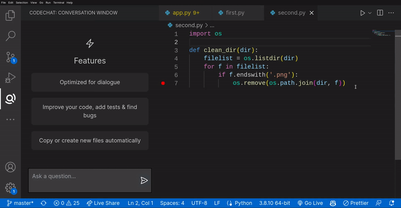

<h1 align="center">


<br>CodeWiz</h1>

<div align="center">
<h2>

Use the power of OpenAI's ChatGPT LLM model to write, refactor, generate, and more!

</h2>


</div>

With just one click, you can create files/projects, fix your code, or utilize OpenAI's official ChatGPT APIs without any configuration! Simply put your API key in the settings, and begin!

# Features

The extension includes a context menu of commands that enables you to send the chosen text or code to the ChatGPT service and display the output in the ChatGPT panel. This panel allows you to copy or move the code to the current file or create a new file and then move the result there.

# Usage
* Initializing the API Key
  * Upon opening the extension for the first time after installation you will be prompted to enter you OpenAI Key once entered you can move on to using the CodeWiz
  
    
  * If for some reason you need to change your key you can do so by going to your settings.json file via the [command pallete](https://code.visualstudio.com/docs/getstarted/userinterface#_command-palette). 
  
    
    
    In settings.json you can change the calue of the following key 
      ```
    {
      "codechat.apiKey": "YOUR API KEY"
    }
    ```
  

* Using the Extension is very intuitive, just open up the command pallete again and type in **CodeWiz**, this opens up a context menu with all the possible commands. **NOTE:** This might be missing few commands which require you select some code in the editor first.


The extension includes a context menu of commands that enables you to send the chosen text or code to the ChatGPT service and display the output in the ChatGPT panel. This panel allows you to copy or move the code to the current file or create a new file and then move the result there.


# Available Commands

- CodeWiz: Ask Anything
- CodeWiz: Refactor Code
- CodeWiz: Generate Comment
- CodeWiz: Generate Code
- CodeWiz: Generate Tests
- CodeWiz: Find Bugs
- CodeWiz: Optimize Code
- CodeWiz: Explain Code
- CodeWiz: Clear Conversation
- CodeWiz: Export Conversation
- CodeWiz: Rewrite Selection
- CodeWiz: Send Selection

---

### Refactor Code


---

### Generate Comment


---

### Generate Code


---

### Generate Tests


---

### Find Bugs


---

### Optimize Code


---

### Explain Code


---

### Rewrite Selection


---

# Customize your code prompts or use defaults

```json
        "codewiz.promptPrefix.addTest": {
          "default": {
            "default": "Generate tests:"
          },
          "description": "The prompt prefix used for adding tests for the selected code",
          "type": "object"
        },
        "codewiz.promptPrefix.summarize": {
          "description": "The prompt prefix used for summarizing text.",
          "default": "Summarize text: ",
          "type": "string"
        },
        "codewiz.promptPrefix.comment": {
          "default": {
            "default": "Generate short comment: "
          },
          "description": "The prompt prefix used to generate comment for selected code.",
          "type": "object"
        },
        "codewiz.promptPrefix.explain": {
          "default": {
            "default": "Explain code: "
          },
          "description": "The prompt prefix used for explaining the selected code",
          "type": "object"
        },
        "codewiz.promptPrefix.findProblem": {
          "default": {
            "default": "Find problems: "
          },
          "description": "The prompt prefix used for finding problems for the selected code",
          "type": "object"
        },
        "codewiz.promptPrefix.generate": {
          "default": {
            "default": "Generate code: "
          },
          "description": "The prompt prefix used generate code base on text",
          "type": "object"
        },
        "codewiz.promptPrefix.optimize": {
          "default": {
            "default": "Optimize code: "
          },
          "description": "The prompt prefix used for optimizing the selected code",
          "type": "object"
        },
        "codewiz.promptPrefix.refactor": {
          "default": {
            "default": "Refactor code and explain what's changed: "
          },
          "description": "The prompt prefix used for refactoring the selected code",
           "type": "object"
        },
        "codewiz.promptPrefix.rewrite": {
          "default": "Rewrite following sentence: ",
          "description": "Will try to rewrite sentences.",
          "type": "string"
        },
        "codewiz.promptPrefix.arbitrary": {
          "default": "Execute the following command on the given code:",
          "description": "The prompt prefix used for sending arbitrary command to ChatGPT",
          "type": "string"
        }
```

If you wish to set prompts based on file type, simply include the file name and the prompt value you desire:

```json
        "codewiz.promptPrefix.addTest": {
          "typescript": "Generate tests typescript:"
        }
```

## Set Prompts Base on File type

# Extension Options

```json
        "codewiz.apiKey": {
          "description": "Openai api key to communicate with chatgpt api",
        },
        "codewiz.maxTokens": {
          "default": 1000,
          "description": "The maximum number of [tokens](/tokenizer) to generate in the completion.  The token count of your prompt plus `max_tokens` cannot exceed the model's context length. Most models have a context length of 2048 tokens (except for the newest models, which support 4096).",
        },
        "codewiz.model": {
          "default": "text-davinci-003",
          "description": "ID of the model to use. You can use the [List models](/docs/api-reference/models/list) API to see all of your available models, or see our [Model overview](/docs/models/overview) for descriptions of them.",
        }
```

# Disclaimer

- There are no assurances that this extension will operate seamlessly and without any adverse effects. Therefore, it is recommended that you exercise caution while using it, as it may undergo modifications that are beyond our control. For instance, OpenAI may introduce unanticipated changes to some or all of its functionalities, which could potentially affect the performance of this extension.

- The extension will employ an API Key that is saved in the settings.json file. It is important to note that VS Code has the ability to synchronize this key across its various instances, and this is not within the purview of this extension. If this is a concern for you, it is recommended that you refrain from utilizing the extension.

- The extension will solely gather metadata to enhance its functionalities, and it will not gather any personally identifiable information. You have the option of enabling or disabling telemetry by setting either 'telemetry.telemetryLevel' or 'codewiz.telemetry.disable' to their corresponding values. The extension will only collect metadata if both of these settings have permitted telemetry.

- We cannot be held responsible for any problems that may occur as a result of using this extension. It should also be noted that your use of OpenAI services is subject to OpenAI's own terms and conditions.
